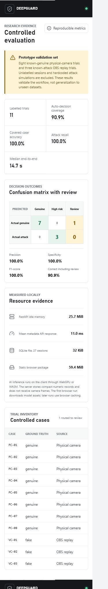

# DeepGuard Graduation Project

DeepGuard is a local-first research prototype for deepfake detection and active facial liveness verification. It combines browser-side face landmark analysis, a quantized ONNX texture classifier, guided blink and head-motion challenges, source-integrity checks, manual review, and a small FastAPI/SQLite results service.



## Repository contents

- `deepguard/`: React, TypeScript, MediaPipe, Transformers.js, FastAPI, and SQLite application source.
- `outputs/FULL_REPORT_FINAL_WITH_EVALUATION.docx`: Complete graduation-project report with Chapters 4 and 5.
- `outputs/DEEPGUARD_FULL_CODE_ARCHITECTURE_GUIDE.docx`: Full 76-page architecture manual with diagrams, algorithms, APIs, tests, deployment guidance, and complete first-party source listings.
- `outputs/evaluation/`: Reproducible controlled-trial CSV and JSON evidence.
- `work/evaluation_assets/`: Confusion matrix, latency, resource charts, and interface screenshots.
- `work/add_evaluation_to_report.py`: Reproducible Word report update script.
- `work/build_code_architecture_guide.py`: Reproducible architecture-manual and diagram builder.

## Run the system

Requirements:

- Node.js and pnpm
- Python 3.11 or newer
- Chrome or Edge with camera permission

```powershell
cd deepguard
pnpm install
python -m venv .venv
.\.venv\Scripts\pip.exe install -r requirements.txt
.\run.ps1
```

Open `http://127.0.0.1:5173`.

The first browser verification downloads and caches the quantized classifier. MediaPipe WASM assets are copied from the installed package by the `postinstall` script, so generated dependency files are not stored in Git.

## Verify

```powershell
cd deepguard
pnpm test
pnpm lint
pnpm build
.\.venv\Scripts\python.exe -m pytest server\test_app.py -q
```

The verified baseline has 14 passing frontend tests and 4 passing API tests.

## Evaluation scope

The controlled validation set contains eleven labelled camera trials: eight known-genuine physical-camera trials and three known-attack OBS virtual-camera trials. The system automatically decided ten cases and routed one low-quality genuine case to manual review.

The 100% precision, recall, F1-score, specificity, and covered-case accuracy reported in the dashboard and report apply only to those ten automatically decided controlled cases. They are not claims of production accuracy. The texture scores remained close to 50.8% in this small sample, so larger public-dataset testing and model calibration are required before deployment.

## Privacy and repository safety

Camera frames and video are processed in the browser and are not sent to FastAPI. Local SQLite sessions, dependency folders, virtual environments, caches, build output, and generated WASM files are excluded from Git.
